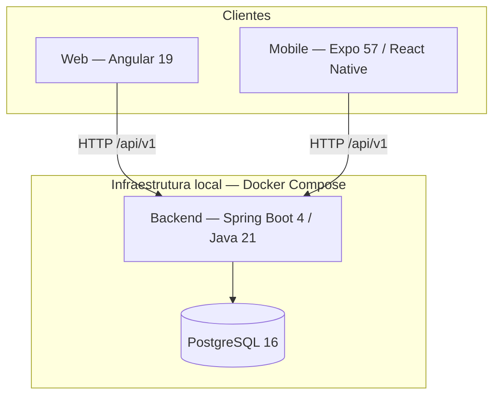

# Arquitetura

Decisões de arquitetura, diagramas e ADRs (*Architecture Decision Records*) do projeto Nutri4You.

## Visão geral

O Nutri4You é um **monorepo** com três aplicações cliente (web Angular, mobile Expo) consumindo uma API REST Spring Boot, persistida em PostgreSQL.



## Stack por camada

| Camada | Tecnologia | Diretório |
| --- | --- | --- |
| API | Spring Boot 4.0.8, Java 21, Spring Security, JPA | `backend/` |
| Web | Angular 19, RxJS, HttpClient | `web/` |
| Mobile | Expo 57, React Native 0.86, React Navigation | `mobile/` |
| Banco | PostgreSQL 16, DDL em SQL | `database/init.sql` |
| Orquestração | Docker Compose | `docker-compose.yaml` |

## Índice

| Documento | Conteúdo |
| --- | --- |
| [Visão geral](visao-geral.md) | Estrutura do monorepo, camadas e fluxo de dados |
| [Banco de dados](banco-de-dados.md) | Schema PostgreSQL (14 tabelas), entidades JPA e seed |
| [Relação paciente↔nutri](modelo-relacao-paciente-nutricionista.md) | Decisão Q11: eventos clínicos, sem vínculo |
| [ADRs](adr/README.md) | Registro de decisões arquiteturais |
| [PoCs — serviços externos](pocs-servicos-externos.md) | TACO, Calendar, storage, deploy |

## Estado atual (Sprint 2 — auth)

### Implementado

- Monorepo com backend, web, mobile e banco containerizados.
- Autenticação JWT stateless com roles `PACIENTE` e `NUTRICIONISTA`.
- Endpoints: health, login, autocadastro paciente/nutricionista, e-mail, gestão de pacientes.
- Web (Angular): telas auth + interceptor JWT + dashboard provisório (S2-W1/W2).
- Mobile: camada HTTP base e health check (JWT mobile = S2-M1).
- CI com Markdown, gitleaks, testes backend, lint/build web e lint/typecheck mobile.

### Pendente (próximas sprints / backlog)

- Entidades JPA para as demais tabelas do schema.
- Módulos de negócio (anamnese, consultas, plano alimentar, etc.).
- Interceptor JWT no mobile (S2-M1).
- OpenAPI/Swagger; rate limiting / fila de e-mail completa.

## Mapa de diretórios

```text
TCC-Nutri4You/
├── backend/          # API REST Spring Boot
├── web/              # SPA Angular
├── mobile/           # App Expo / React Native
├── database/         # init.sql (DDL + seed)
├── docker-compose.yaml
├── docs/             # Documentação do projeto
└── .github/workflows/ci.yml
```
