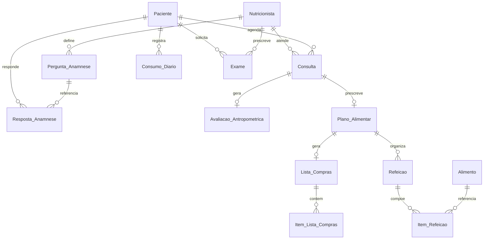

# Banco de dados

O Nutri4You utiliza **PostgreSQL 16**. O schema completo está em `database/init.sql` e é aplicado automaticamente na primeira subida do container via volume Docker.

## Configuração de conexão

| Parâmetro | Valor (desenvolvimento) |
| --- | --- |
| Host | `localhost` / `127.0.0.1` |
| Porta | `5432` |
| Database | `nutri4you_db` |
| Usuário | `springuser` |
| Senha | `password` |

Spring Boot usa `SPRING_JPA_HIBERNATE_DDL_AUTO=none` — o schema **não** é gerado pelo Hibernate; apenas o SQL versionado é a fonte de verdade.

## Diagrama entidade-relacionamento (visão lógica)

## Tabelas

| # | Tabela | Domínio | Entidade JPA |
| --- | --- | --- | --- |
| 1 | `Nutricionista` | Atores | Sim |
| 2 | `Paciente` | Atores | Sim |
| 3 | `Pergunta_Anamnese` | Anamnese | Não |
| 4 | `Resposta_Anamnese` | Anamnese | Não |
| 5 | `Consulta` | Atendimento (relaciona paciente ↔ nutricionista) | Não |
| 6 | `Avaliacao_Antropometrica` | Antropometria | Não |
| 7 | `Exame` | Exames | Não |
| 8 | `Plano_Alimentar` | Prescrição | Não |
| 9 | `Lista_Compras` | Prescrição | Não |
| 10 | `Item_Lista_Compras` | Prescrição | Não |
| 11 | `Refeicao` | Prescrição | Não |
| 12 | `Consumo_Diario` | Acompanhamento mobile | Não |
| 13 | `Alimento` | Banco TACO | Não |
| 14 | `Item_Refeicao` | Prescrição | Não |

> **Q11 (Sprint 2):** removida `Vinculo_Nutricional`. Relação clínica derivada de eventos — ver [modelo-relacao-paciente-nutricionista.md](./modelo-relacao-paciente-nutricionista.md). Na Sprint 1, apenas `Paciente` e `Nutricionista` possuem entidades JPA mapeadas. As demais tabelas existem no DDL para suportar features futuras.

## Entidades JPA implementadas

### Paciente

| Coluna | Tipo | Constraints |
| --- | --- | --- |
| `id_paciente` | SERIAL | PK |
| `nome` | VARCHAR(150) | NOT NULL |
| `cpf` | VARCHAR(14) | UNIQUE |
| `data_nascimento` | DATE | — |
| `sexo` | VARCHAR(20) | — |
| `telefone` | VARCHAR(20) | — |
| `email` | VARCHAR(100) | NOT NULL, UNIQUE |
| `senha` | VARCHAR(255) | NOT NULL |

Implementa `UserDetails` com authority `ROLE_PACIENTE`.

### Nutricionista

| Coluna | Tipo | Constraints |
| --- | --- | --- |
| `id_nutricionista` | SERIAL | PK |
| `nome` | VARCHAR(150) | NOT NULL |
| `email` | VARCHAR(100) | NOT NULL, UNIQUE |
| `senha` | VARCHAR(255) | NOT NULL |
| `crn` | VARCHAR(20) | NOT NULL, UNIQUE |

Implementa `UserDetails` com authority `ROLE_NUTRICIONISTA`.

### Token_Email (Sprint 2 — Q27)

| Coluna | Tipo | Constraints |
| --- | --- | --- |
| `id_token` | SERIAL | PK |
| `token` | UUID | NOT NULL, UNIQUE |
| `tipo` | VARCHAR(30) | NOT NULL (`CONFIRMACAO_EMAIL` \| `RECUPERACAO_SENHA`) |
| `id_paciente` | INT | FK nullable |
| `id_nutricionista` | INT | FK nullable |
| `expira_em` | TIMESTAMP | NOT NULL |
| `usado_em` | TIMESTAMP | — |

Constraint `chk_token_titular`: exatamente um titular (XOR paciente **ou** nutricionista). Confirmação de e-mail permanece só para paciente.

## Dados seed (mock)

O `init.sql` inclui dados iniciais para desenvolvimento:

| Recurso | Quantidade | Detalhe |
| --- | --- | --- |
| Nutricionistas | 1 | `nutri@nutri4you.com` / senha texto `password` |
| Pacientes | 2 | `arthur@email.com`, `artur@email.com` |
| Consultas demo | 2 | Pacientes seed ↔ nutricionista seed |
| Alimentos (TACO) | 5 | Arroz, feijão, frango, ovo, banana |
| Perguntas de anamnese | 3 | Categorias Geral, Hábitos, Saúde |

## Trigger

A tabela `Resposta_Anamnese` possui trigger `trg_atualiza_timestamp_resposta` que atualiza `data_ultima_atualizacao` automaticamente em `UPDATE`.

## Estratégia de migrações

Atualmente o projeto usa um único script DDL (`init.sql`) montado no volume Docker. Para evoluções futuras, considerar:

- Flyway ou Liquibase para migrações incrementais.
- Separar DDL de seed em arquivos distintos.
- Scripts de rollback documentados.
