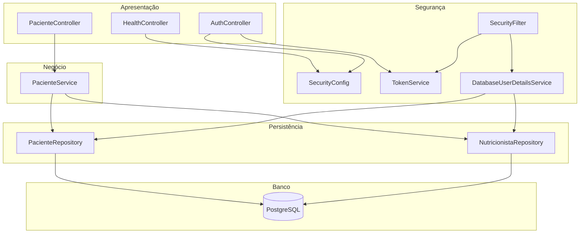
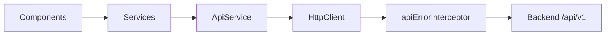
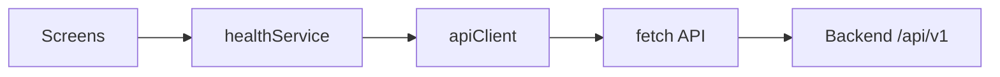
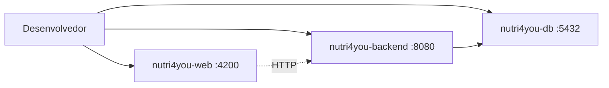
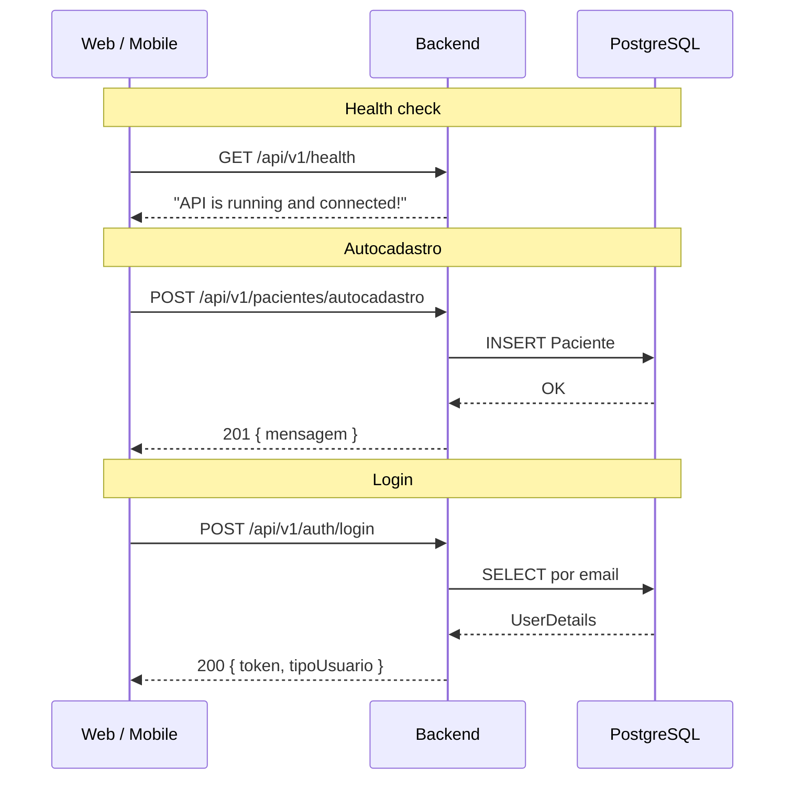

# Visão geral da arquitetura

## Monorepo

Todo o código-fonte do TCC vive em um único repositório Git. Isso facilita:

- Versionamento coordenado entre API e clientes.
- Docker Compose unificado para desenvolvimento local.
- Documentação centralizada em `docs/`.

## Camadas do backend

| Camada | Pacote | Responsabilidade |
| --- | --- | --- |
| Controller | `controller/` | Endpoints REST, DTOs de entrada/saída |
| Service | `service/` | Regras de negócio |
| Repository | `repository/` | Acesso a dados via Spring Data JPA |
| Model | `model/` | Entidades JPA + `UserDetails` |
| Security | `security/` | JWT, filtro, carregamento de usuário |
| Config | `config/` | Spring Security, beans |

## Camadas dos clientes

### Web (Angular)

| Camada | Caminho | Responsabilidade |
| --- | --- | --- |
| Features | `src/app/features/` | Telas (home, health, not-found) |
| Services | `src/app/core/services/` | `ApiService`, `HealthService` |
| Interceptors | `src/app/core/interceptors/` | Normalização de erros HTTP |
| Models | `src/app/core/models/` | Tipos TypeScript da API |
| Environment | `src/environments/` | `apiBaseUrl` por ambiente |

Rotas definidas em `app.routes.ts`. Módulos de negócio serão carregados via `loadChildren` a partir da Sprint 2.

### Mobile (Expo)

| Camada | Caminho | Responsabilidade |
| --- | --- | --- |
| Screens | `src/screens/` | Telas (Home, Health) |
| Navigation | `src/navigation/` | Stack Navigator |
| API | `src/core/api/` | `apiClient`, services, types |
| Config | `src/core/config/` | `env.apiBaseUrl` (IP local via Expo) |

O mobile detecta automaticamente o IP da máquina de desenvolvimento via `expo-constants` (`hostUri` / `debuggerHost`).

## Infraestrutura local (Docker Compose)

| Serviço | Container | Portas | Volumes |
| --- | --- | --- | --- |
| `postgres-db` | `nutri4you-db` | 5432 | `postgres-data`, `init.sql` |
| `backend` | `nutri4you-backend` | 8080, 5005 (debug) | código fonte + cache Maven |
| `web` | `nutri4you-web` | 4200 | código fonte + `node_modules` |

O mobile **não** roda em container — executa localmente via Expo Go na mesma rede Wi-Fi do host.

## Fluxo de dados — Sprint 1

## Integração contínua

Pipeline em `.github/workflows/ci.yml`:

| Job | Ferramenta | Escopo |
| --- | --- | --- |
| Validação de Markdown | markdownlint-cli2 | `**/*.md` |
| Detecção de segredos | gitleaks | Histórico completo |
| Gate | — | Falha se qualquer job anterior falhar |

Build e testes de backend, web e mobile ainda **não** fazem parte do CI.
